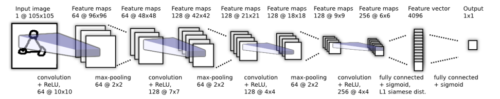

# Siamese-Neural-Networks-One-Shot-Image-Recognition

## Overview
This project implements Siamese Neural Networks (Siamese NN) to perform one-shot learning for facial recognition. The model compares two images and predicts their similarity, outputting `1` for identical faces and `0` for different faces. This approach is inspired by the following paper:

**Koch, Gregory, Richard Zemel, and Ruslan Salakhutdinov. "Siamese neural networks for one-shot image recognition."**  
_ICML Deep Learning Workshop. Vol. 2. No. 1. 2015._

Sample Prediction:  


---

## Project Structure

### Key Files
- **`config.py`**: Configuration file to customize model architecture, training parameters, and data handling including augmentation. Default settings align with the best architecture from our attempts.
- **`dataset.py`**: Handles loading and preprocessing of the dataset, including pairing images based on similarity labels.
- **`model.py`**: Defines the Siamese NN architecture and includes training and prediction functions.
- **`main.py`**: Script to run visualization, training, and testing with a menu-based interface.
- **`mainColab.ipynb`**: A notebook to run experiments on Google Colab, utilizing the gratitude GPU. Also containes experiment example. Usage instructions inside. 
- **`requirements.txt`**: Contains all dependencies required to run the project.
- **`report.pdf`**: A Hebrew report detailing the thought process throughout the attempts.

Base Architecture:  


** Final Architecture in config.py

---

## Usage

### Dataset
The data used in this project is sourced from [LFW-a Dataset](https://talhassner.github.io/home/projects/lfwa/index.html), which provides aligned grayscale twin photos.  

- **Dataset Preparation**:
  - Download and extract the dataset zip file.
  - Ensure `train.txt` and `test.txt` files are in the extracted folder, as these define how images are split into training and testing sets.
  
- **DataLoader**:
  The `dataset.py` module processes the folders and `.txt` files to create a dataset. It outputs batches like this (Menu -> 1):  
  

### Environment Setup
Ensure you have Python installed and follow these steps to set up the environment:

```bash
python -m venv venv
venv\Scripts\activate  # On Windows
pip install --upgrade pip
pip install -r requirements.txt
```

## Features
### Building the Model
The main module offers some help in planning the CNN dimentions and needed FC dimentions based on the planned architecture (Menu -> 2).

### Training
(Menu -> 3)
- Train the Siamese Neural Network from scratch using a stratified split of the dataset.
- Supports early stopping based on validation loss.
- Configurable parameters such as batch size, learning rate, and L2 regularization through `config.py`.

### Prediction
- Load a pretrained model and evaluate its accuracy on the test set (Menu -> 4).
- Visualize sample predictions with their similarity scores.
- Visualize the worst predictions to gain insights over the model's difficulty, as well as a confidence histogram of the trained model (Menu -> 5).


---

## Results

This problem is not very well predicted by this model, which tends to overfit. Our best attempt reached 73.9% accuracy on the test set.
We found that:
- Augmentation on the data helps, as this is a very small dataset.
- Regularization is a MUST, but with L2 and not Dropout.
- Using the original image size (250X250) with slight increase to the architecture helps.


## GitHub
### Initiating Git Repository
To clone this repository locally:
```
git init
git remote add origin https://github.com/shaharoded/Siamese-Neural-Networks-One-Shot-Image-Recognition.git
git status
```
Alternatively, you can initialize a local repository:
```
git clone https://github.com/shaharoded/Siamese-Neural-Networks-One-Shot-Image-Recognition.git
```

### Git Updates
To publish updates:
```
git add .
git commit -m "commit message"
git branch -M main
git push -f origin main
```

## Citations

This project utilizes the following datasets and research:

1. **Gary B. Huang, Manu Ramesh, Tamara Berg, and Erik Learned-Miller.**  
   *Labeled Faces in the Wild: A Database for Studying Face Recognition in Unconstrained Environments.*  
   University of Massachusetts, Amherst, Technical Report 07-49, October, 2007.

2. **Lior Wolf, Tal Hassner, and Yaniv Taigman.**  
   *Effective Face Recognition by Combining Multiple Descriptors and Learned Background Statistics.*  
   IEEE Transactions on Pattern Analysis and Machine Intelligence (TPAMI), 33(10), October 2011.

The aligned dataset, LFW-a, was created and contributed by Lior Wolf, Tal Hassner, and Yaniv Taigman.
